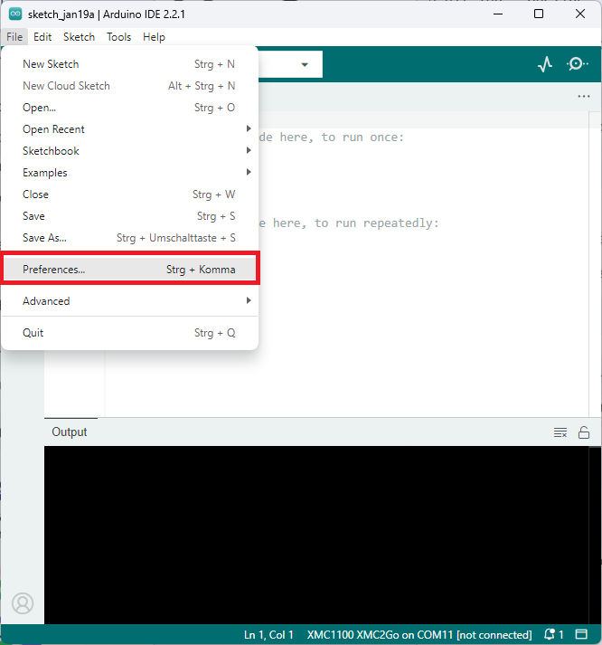
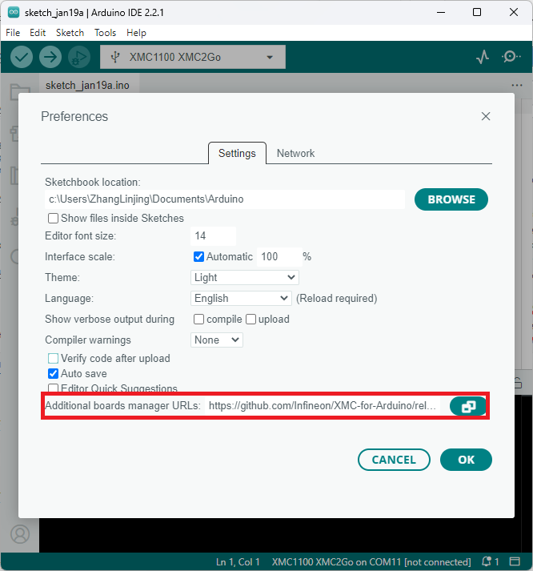
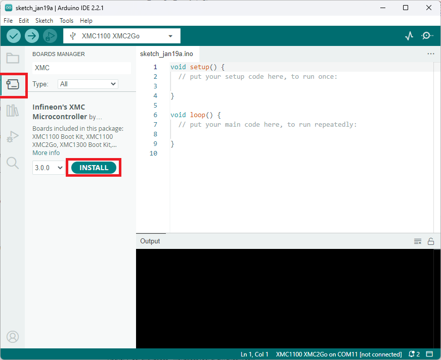

## Overview
This repository contains the integration of [Infineon's](https://www.infineon.com/) XMC microcontrollers into the [Arduino IDE](https://www.arduino.cc/en/main/software).
Supported boards by this repository are listed under 'Microcontroller Boards' in the following section or in the sidebar. Boards currently in development are not listed here at the moment.

## Installation Instructions

### Prework for SEGGER J-Link

In order to use the Infineon XMC microcontrollers by this repository and program them, you need [SEGGER J-Link](https://www.segger.com/downloads/jlink) installed on your PC. Please follow this link [SEGGER J-Link](https://www.segger.com/downloads/jlink) and install the J-Link Software and Documentation Pack for your respective operating system (OS).
If you have already installed '[DAVE™ - Development Platform for XMC™ Microcontrollers](https://www.infineon.com/cms/de/product/microcontroller/32-bit-industrial-microcontroller-based-on-arm-registered-cortex-registered-m/dave-version-4-free-development-platform-for-code-generation/channel.html?channel=db3a30433580b37101359f8ee6963814)', you might skip this step as you should have the respective drivers on your system.


### Required tools

XMC-for-Arduino requires Python 3.x and the `serial` and `pyserial`. Make sure Python is installed in your machine and available in the system path.
You can check if it was successfully installed by opening your command line or terminal and typing:
```
  python --version
```
With [pip](https://pip.pypa.io/en/stable/installation/) available, install the mentioned packages from a terminal:

```
  pip install serial pyserial
```

### Integration in Arduino IDE
Please first download the Arduino IDE. This library only tested for Arduino IDE >=1.5, recommended to use Arduino IDE >=2.0.



Paste the following URL into the 'Additional Boards Manager URLs' input field under **File** > **Preferences** to add Infineon's microcontroller boards to the Arduino IDE.

https://github.com/Infineon/XMC-for-Arduino/releases/latest/download/package_infineon_index.json

Easier to copy (no clickable link):

```
https://github.com/Infineon/XMC-for-Arduino/releases/latest/download/package_infineon_index.json
```



To install the boards, please go now to **Tools** > **Board** > **Boards Manager...** and search for XMC. You will see options to install the board files for the microcontrollers. Click "Install" to add the boards to your Arduino IDE.



In the boards list **Tools** > **Board**, you will now find the supported XMC microcontroller boards. 


### Notes

* **The differences of the boards included in this repository if compared to the Arduino boards**
* **Refer also to the LICENSE.md/txt file of the repositories for further information**
